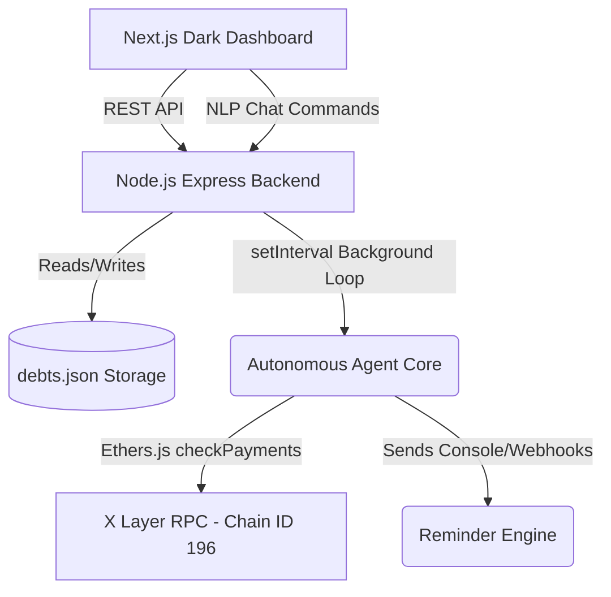

# Pay Me Back Agent (OKX Build X Hackathon)

## 🔥 Project Title
**Pay Me Back Agent** - Your autonomous debt collection assistant on X Layer.

## 💡 Problem Statement
Informal borrowing and lending among friends, colleagues, or peers usually leads to awkward conversations, forgotten debts, and a lack of accountability. Tracking these small transactions is mentally taxing, and there's no native incentive or trustless verification for clearing these debts effectively without centralized intermediaries.

## 🚀 Solution Overview
The **Pay Me Back Agent** is an autonomous AI agent built for the X Layer network. It removes the social friction out of informal loans. You converse with the agent ("I lent John $20"), and it securely logs the debt, generates X Layer wallet payment requests, and autonomously checks the blockchain to verify when you have been paid back. If someone is late, the agent takes the burden of sending "Gentle" or "Urgent" reminders automatically.

## 🏗 Architecture

## 🌐 X Layer Integration Explanation
This project heavily relies on **X Layer** (Chain ID: 196) for transparency and trustless settlements.
Using `ethers.js`, the agent securely connects to `https://rpc.xlayer.tech`. 
- **Payment Verification**: The agent checks the blockchain state to see if sufficient OKB or stablecoins have hit the designated wallet address.
- **Gas Efficiency**: The use of X Layer makes these micro-transactions extremely cheap, meaning users can pay back $5 lunch debts without worrying about massive gas fees.
- **Autonomy**: Our agent checks transactions securely and trustlessly without a central database verifying the actual movement of funds.

## 🤖 How the Agent Works Step-By-Step
1. **Intake**: User tells the ChatBox: *"I lent Alice $50"*.
2. **Setup**: Agent logs it and generates a custom `Pay Me` request with an X Layer address.
3. **Loop**: A background process (`setInterval`) wakes up every 60 seconds to query X Layer.
4. **Enforce**:
   - If > 3 days unpaid: Agent fires off a **Gentle Reminder**.
   - If > 7 days unpaid: Agent escalates to an **Urgent Reminder**.
5. **Settlement**: The moment the payment hits the X Layer chain, the Agent automatically marks the debt as Paid in real-time. No manual confirmation needed!

## ⚙️ Setup Instructions
You'll need two terminals.

**1. Backend (The Agent)**
\`\`\`bash
cd backend
npm install
# Ensure .env has PRIVATE_KEY populated
node server.js
\`\`\`

**2. Frontend (The UI)**
\`\`\`bash
cd frontend
npm install
npm run dev
\`\`\`
Go to **http://localhost:3000** in your browser.

## 🎥 Demo Flow Script (Hackathon Demo)
1. **Open UI**: Show the sleek dark-mode Next.js UI showing the Dashboard.
2. **Add Debt via Chat**: In the right-hand ChatBox, type *"I lent Bob $100"*.
   - Watch the agent respond intelligently and the dashboard update instantly.
3. **Show X Layer Payment Modal**: Click "View Payment" on Bob's newly created debt.
   - Point out the generated X Layer address and the QR code.
4. **Trigger Agent Autonomy**: Switch to the CLI. Show that `node server.js check` is running in the background every 60s looking at X Layer.
5. **Simulate Action**: Click "Simulate Payment Received". 
   - *Boom!* The UI updates dynamically. The debt moves to "Paid" with green branding, and Total Recovered increments up.
6. **Reminders**: Mention that if you don't do step 5, the Agent fires off Reminders on day 3 and day 7.

## 💻 Tech Stack
- Next.js (App Router), React, TailwindCSS, Lucide Icons
- Node.js, Express.js
- Ethers.js
- Local JSON Storage
- X Layer Blockchain (RPC `https://rpc.xlayer.tech`)

## 🛠 Future Improvements
- Implement OpenAI integration to replace Regex logic, allowing complex natural language parsing (e.g. "Bob gave me back half of the $100 he owed me").
- Add SMS / Telegram bot integrations so the agent can ping debtors directly.
- Add Smart Contract Escrow feature so funds are locked until both parties confirm.
